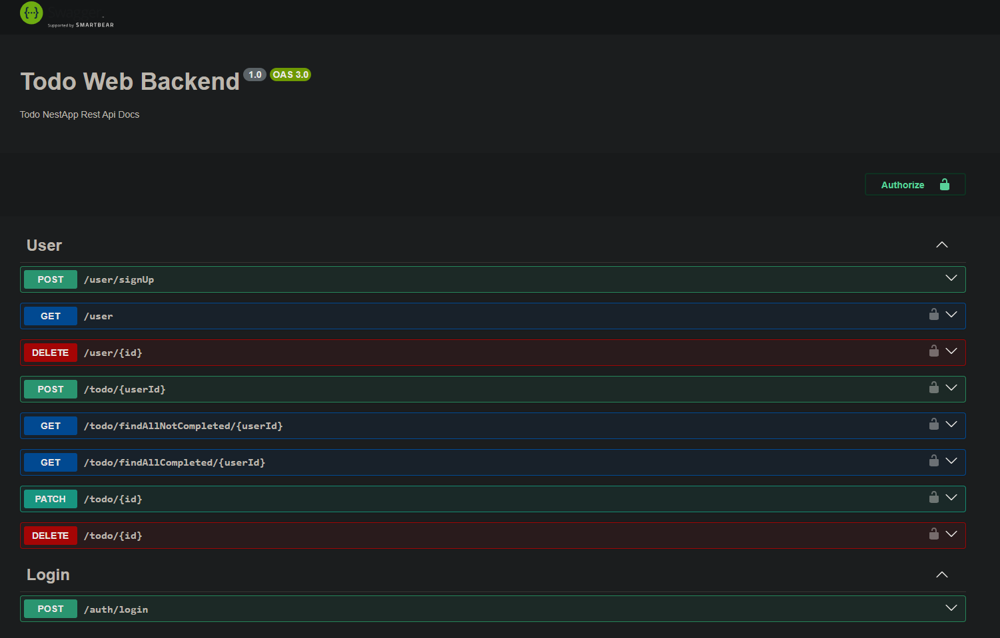

# Todo Web Backend

**Todo Web Backend Stack**  

The backend for the Todo web application is built using the following technologies:  

- **TypeScript**: Strongly typed programming language for better code maintainability and scalability.  
- **NextJS**: React-based framework for server-side rendering and API routes.  
- **TypeORM**: Object-Relational Mapper for seamless database interactions.  
- **PostgreSQL**: Robust and reliable relational database system.  
- **JWT (JSON Web Token)**: Secure user authentication and authorization mechanism.  
- **Swagger**: API documentation tool for clear and interactive API specifications.  

[Link to tutorial video for this project](https://www.youtube.com/watch?v=YXQr2LhYm0c&t=728s)

